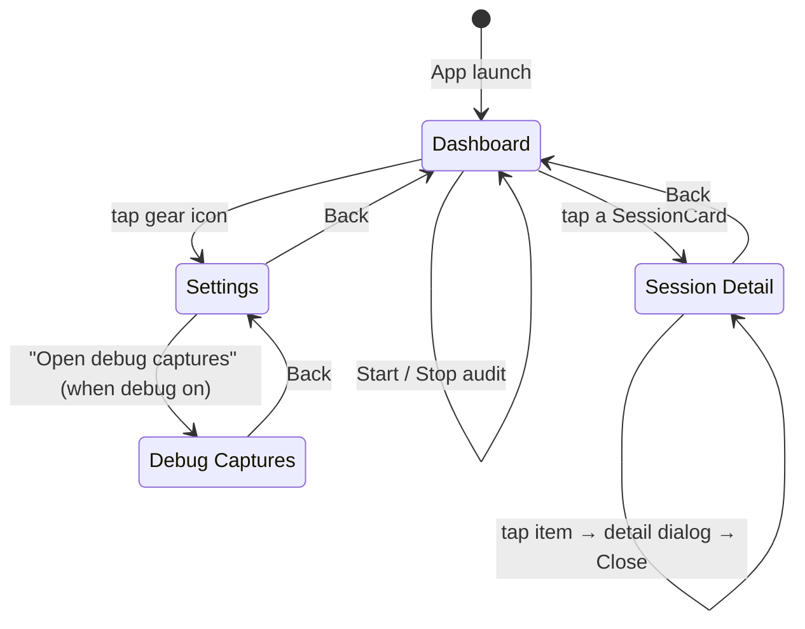
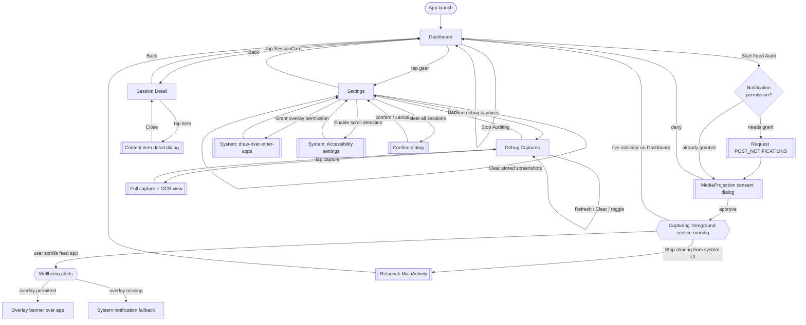

# Pavlova — UI Flow & User Interactions

This document captures **every screen and the user interactions that move between
them** (or trigger side effects). It is written as a [Mermaid](https://mermaid.js.org/)
diagram so it renders automatically on GitHub, in VS Code (with a Mermaid
preview extension), and in most Markdown tooling — and stays diff-able in
version control.

## How this diagram was built

1. **Enumerate the screens** from the single `NavHost` in `MainActivity.kt`.
   Pavlova has four routes: `dashboard` (start), `session/{sessionId}`,
   `settings`, `debug`.
2. **List the transitions** — every `navController.navigate(...)` /
   `popBackStack()` call, plus the callbacks each screen exposes
   (`onOpenSession`, `onOpenSettings`, `onOpenDebugCaptures`, `onBack`).
3. **Add in-screen interactions** that don't navigate but change state or open
   dialogs/system screens (toggles, Start/Stop audit, permission prompts,
   item detail dialog).
4. **Add system / cross-app transitions** that re-enter the app (MediaProjection
   consent, "Stop sharing" from the system UI relaunching the dashboard).

To regenerate after a UI change: update the relevant nodes/edges below, then
preview the Markdown. For a generated alternative you could also use Android
Studio's **Navigation Editor** (if the app migrated to a nav-graph XML) or a
tool like `mermaid-cli` (`mmdc -i UI_FLOW.md -o ui_flow.svg`) to export an image.

---

## Screen & navigation map

## Full interaction graph (incl. permissions & system flows)

---

## Legend

| Shape | Meaning |
|-------|---------|
| `[Rounded]` / `[Box]` | A Compose screen (NavHost destination) |
| `{{Double box}}` | A runtime state (e.g. capturing, alert firing) |
| `[[Double bracket]]` | A dialog, system screen, or one-shot action |
| `{Diamond}` | A decision / permission check |

## Maintenance checklist

When you add or change UI, update this file if you:

- add a `composable(...)` route in `MainActivity` (new screen node),
- add a `navController.navigate(...)` / `popBackStack()` (new edge),
- add a button/toggle/dialog that changes state (in-screen self-edge), or
- add a permission prompt or cross-app re-entry (system flow).

